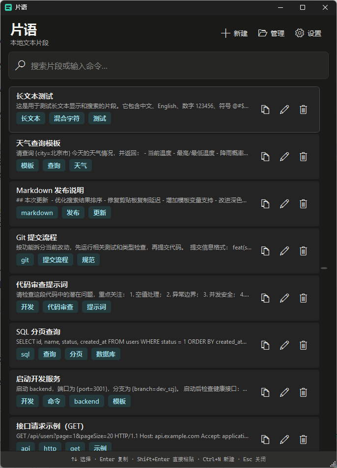

<p align="right"><a href="README.zh-CN.md">中文</a> · <a href="README.md">English</a></p>

# Pianyu

[](https://github.com/bigsu/pianyu/actions/workflows/release.yml)
[](https://github.com/bigsu/pianyu/releases/latest)
[](#requirements)

A local-first, keyboard-first Windows text snippet manager for saving, searching, copying, and reusing prompts, commands, and workflow text.



## Download and run

Download the latest `pianyu.exe` from [Releases](https://github.com/bigsu/pianyu/releases/latest), place it in a writable folder, and run it.

- The executable is self-contained and includes its .NET and SQLite runtime dependencies.
- `pianyu.db` is created beside the executable on the first write.
- To upgrade, replace the executable and keep the existing `pianyu.db`.
- Windows SmartScreen may show an “Unknown publisher” warning because current builds are not commercially code-signed.

## Highlights

- Create, edit, favorite, pin, tag, soft-delete, and undo deletion.
- SQLite FTS5 search across titles, content, and tags.
- Pinyin initials, typo tolerance, common abbreviations, and learned personal aliases.
- Dynamic ranking using relevance, recency, copy count, favorites, pins, and foreground-app context.
- Parameterized templates such as `{port=3001}` with recent values.
- `Space` to copy and close, `Enter` to copy while keeping the panel open, and `Shift+Enter` to paste directly.
- Explicit clipboard capture and time-limited monitoring; candidates are never saved without confirmation.
- Configurable shortcuts with conflict detection and restore-default support.
- Dark, light, and system-following themes.
- JSON import/export and SQLite backup/restore.
- Optional LLM assistance that never blocks local search, save, copy, paste, or ranking.

## Default shortcuts

| Action | Shortcut |
| --- | --- |
| Show/hide Pianyu | `Ctrl+Alt+Space` |
| Save current clipboard | `Ctrl+Alt+S` |
| Copy and close | `Space` |
| Paste directly | `Shift+Enter` |
| Copy and keep open | `Enter` |
| New snippet | `Ctrl+N` |
| Edit snippet | `Ctrl+E` |
| Delete snippet | `Delete` |
| Undo deletion | `Ctrl+Z` |

All shortcuts can be changed in **Settings → Shortcuts**.

## Privacy and data

- No account, telemetry, or cloud sync.
- Snippets, tags, shortcuts, and settings remain in the local `pianyu.db`.
- Clipboard monitoring is off by default, and clipboard content is never auto-saved.
- LLM integration is optional; API keys are protected with Windows DPAPI for the current user.
- The repository and GitHub Releases contain no user database, API key, or personal snippets.

## Build and test

Building requires Windows 10/11 and the .NET 8 SDK:

```powershell
dotnet restore Pianyu.sln
dotnet build Pianyu.sln -c Release --no-restore
dotnet test Pianyu.sln -c Release --no-build
dotnet publish src/Pianyu.App/Pianyu.App.csproj `
  -c Release -r win-x64 --self-contained true `
  -p:PublishSingleFile=true -p:IncludeNativeLibrariesForSelfExtract=true `
  -o artifacts/release
```

## Project layout

```text
src/Pianyu.Core     Domain models, search, ranking, and template algorithms
src/Pianyu.App      WPF UI, SQLite repository, Windows services, and model adapter
tests/Pianyu.Tests  Unit, integration, and fallback tests
.github/workflows    Windows build, test, and release automation
```

## Requirements

- Windows 10 version 2004 or later, or Windows 11
- x64 processor
- Release builds require no separate .NET or SQLite installation

## Releases and security

Pushing a tag such as `v1.0.0` runs GitHub Actions to build, test, and publish the self-contained single-file `片语.exe`.

Please do not commit `pianyu.db`, exported snippet data, API keys, or other personal content. The repository `.gitignore` excludes common local-data and secret files.
