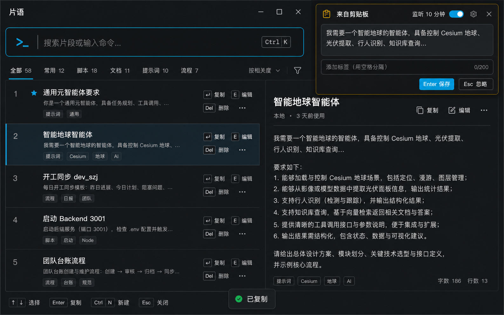

# 片语 / Pianyu

[](https://github.com/bigsu/pianyu/actions/workflows/release.yml)
[](https://github.com/bigsu/pianyu/releases/latest)
[](#系统要求--requirements)

**片语**是一款本地优先、键盘优先的 Windows 文本片段管理工具，用于快速保存、搜索、复制和复用提示词、命令及流程文本。

**Pianyu** is a local-first, keyboard-first text snippet manager for Windows. It helps you save, search, copy, and reuse prompts, commands, and workflow text without turning them into a complicated knowledge base.

> 中文文档在前，English documentation follows below.



## 中文

### 下载与使用

从 [Releases](https://github.com/bigsu/pianyu/releases/latest) 下载最新的 `片语.exe`，放到一个可写目录后直接运行。

- 单文件、自包含，目标电脑无需安装 .NET 或 SQLite。
- 第一次保存数据时，会在 EXE 同目录创建 `pianyu.db`。
- 升级时替换 EXE 即可；保留原来的 `pianyu.db`。
- Windows SmartScreen 可能提示“未知发布者”，因为当前构建未进行商业代码签名。

### 核心功能

- 新建、编辑、收藏、置顶、标签、软删除与撤销删除。
- SQLite FTS5 全文搜索，支持标题、正文和标签。
- 拼音首字母、轻微输错、常用缩写及个人搜索别名。
- 综合相关度、近期使用、复制次数、收藏、置顶和当前应用的动态排序。
- `{port=3001}` 形式的参数化模板与最近变量值。
- `Enter` 复制并关闭、`Shift+Enter` 直接粘贴、`Ctrl+Enter` 连续复制。
- 手动读取剪贴板，或主动开启限时监听；候选内容始终需要确认才会保存。
- 全部快捷键可录制、清除和恢复，冲突时保留原快捷键。
- 深色、浅色、跟随系统三种主题。
- JSON 导入导出、SQLite 备份与恢复。
- 可选的大模型辅助层；模型离线、超时或未配置时，本地功能仍正常工作。

### 隐私与数据

- 无账号、无遥测、无云同步。
- 片段、标签、快捷键和设置均保存在本地 `pianyu.db`。
- 默认不监听剪贴板，不会未经确认自动收录内容。
- 模型功能完全可选；API Key 使用 Windows DPAPI 按当前用户加密。
- 仓库和 GitHub Release 不包含任何用户数据库、API Key 或个人片段。

### 默认快捷键

| 动作 | 快捷键 |
|---|---|
| 显示/隐藏片语 | `Ctrl+Alt+Space` |
| 保存当前剪贴板 | `Ctrl+Alt+S` |
| 复制并关闭 | `Enter` |
| 直接粘贴 | `Shift+Enter` |
| 复制并保持打开 | `Ctrl+Enter` |
| 新建片段 | `Ctrl+N` |
| 编辑片段 | `Ctrl+E` |
| 删除片段 | `Delete` |
| 撤销删除 | `Ctrl+Z` |

所有快捷键均可在“设置 → 快捷键”中修改。

### 构建与测试

需要 Windows 10/11 和 .NET 8 SDK：

```powershell
dotnet restore Pianyu.sln
dotnet build Pianyu.sln -c Release --no-restore
dotnet test Pianyu.sln -c Release --no-build
dotnet publish src/Pianyu.App/Pianyu.App.csproj `
  -c Release -r win-x64 --self-contained true `
  -p:PublishSingleFile=true -p:IncludeNativeLibrariesForSelfExtract=true `
  -o artifacts/release
```

### 工程结构

```text
src/Pianyu.Core     领域模型、搜索、排序和模板算法
src/Pianyu.App      WPF 界面、SQLite 仓储、Windows 服务和模型适配器
tests/Pianyu.Tests  单元测试、集成测试、失败回退和性能测试
.github/workflows   Windows 构建、测试和自动发布
```

## English

### Download and run

Download the latest `片语.exe` from [Releases](https://github.com/bigsu/pianyu/releases/latest), place it in a writable folder, and run it.

- The executable is self-contained and includes its .NET and SQLite runtime dependencies.
- `pianyu.db` is created beside the executable on the first write.
- To upgrade, replace the executable and keep your existing database.
- Windows SmartScreen may show an “Unknown publisher” warning because current builds are not commercially code-signed.

### Highlights

- Create, edit, favorite, pin, tag, soft-delete, and undo deletion.
- SQLite FTS5 search across titles, content, and tags.
- Pinyin initials, typo tolerance, abbreviations, and learned personal aliases.
- Deterministic ranking using relevance, recency, copy count, favorites, pins, and foreground-app context.
- Parameterized templates such as `{port=3001}` with recent values.
- Copy-and-close, direct paste, and keep-open copy workflows.
- Explicit clipboard capture and time-limited monitoring; candidates are never saved without confirmation.
- Fully configurable local and global shortcuts with conflict rollback.
- Dark, light, and system-following themes.
- JSON import/export and SQLite backup/restore.
- Optional LLM assistance that never blocks local search, save, copy, paste, or ranking.

### Privacy

- No account, telemetry, or cloud sync.
- Snippets, tags, shortcuts, and settings remain in the local `pianyu.db`.
- Clipboard monitoring is off by default, and clipboard content is never auto-saved.
- LLM integration is optional. API keys are protected with Windows DPAPI for the current user.
- The repository and GitHub releases contain no user database, API key, or personal snippets.

### Build

Building requires Windows 10/11 and the .NET 8 SDK. Use the PowerShell commands in the Chinese section above, or run the included GitHub Actions workflow.

## 系统要求 / Requirements

- Windows 10 version 2004 or later, or Windows 11
- x64 processor
- No separate .NET or SQLite installation is required for Release builds

## Release automation

Every push and pull request runs formatting, build, and tests on `windows-latest`. Pushing a tag such as `v1.0.0` publishes a self-contained single-file `片语.exe` to GitHub Releases.

## Security

Please do not commit `pianyu.db`, exported snippet data, API keys, or other personal content. The repository `.gitignore` excludes the common local-data and secret files used by this project.
